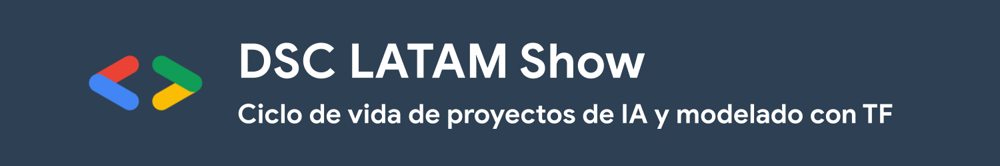

  
  
  

## Descripción

#### _"DSC LATAM Show - Ciclo de vida en proyectos de IA: Creación y servicio de modelos con TensorFlow"_

La inteligencia artifical (IA) crece a pasos agigantados y resulta imprescindible poder desarrollar nuevas tecnologías capaces de resolver nuevas problemáticas en nuestro entorno. En esta charla aprenderás sobre un ciclo de vida y estructura de proyectos de IA y cómo puedes crear modelos de ML utilizando TensorFlow, un framework para creación de modelos de IA desarrollado por Google, y que ahora cuenta con un ecosistema que te permite servir modelos de IA incluso en tu navegador.

## Contenido de la cápsula

- Introducción
- Ciclo de vida de proyectos de IA
- Contexto sobre modelos de IA
- Caso práctico con TensorFlow
- Despliegue en Google Cloud

Puedes encontrar los slides en vivo [**AQUÍ**](https://docs.google.com/presentation/d/e/2PACX-1vRHgFbSTBMtX2GWmx69SR7gssgvTN5IbJNW2Nk1EoJTvxKX_l0FO3oecOdJfqH4VtOmzGDUPrVDjQU3/pub?start=false&loop=false&delayms=300).

Puedes abrir el cuaderno de trabajo directamente a través del siguietne botón: 

> Es importante mencionar que el contenido hace uso de un ambiente en la nube para el desarrollo del material; sin embargo, podrás ejecutar el código de manera local si cuentas con los requerimeintos necesarios.

## Instrucciones para estudiantes

El código y los ejercicios se desarrollarán en Python 3.7+ usando [TensorFlow](https://www.tensorflow.org/), que adopta a [Keras](https://www.tensorflow.org/versions/r2.0/api_docs/python/tf/keras) como interfaz de alto nivel para construir y entrenar redes neuronales.

#### Requerimientos:
* Una laptop.
* Este repositorio de GitHub clonado y actualizado antes del taller.
* Un sentido aventurero en los datos y la IA.
* Un ambiente Python 3.7+ con Anaconda (en casod e querer ejecutar el código de manera local).

Los talleres serán impartidos usando *notebooks* de Jupyter, documentos con código ejecutable, texto, ecuaciones, visualizaciones, imágenes y demás material. Los *notebooks* se pueden crear y ejecutar en la nube vía Google Colab o de manera local en tu computadora a través de [Jupyter Notebooks o JupyterLab](https://jupyter.org/).

Para fines prácticos de este taller (al ser online) utilizaremos Google Colab.

### Google Colab

[Colab](https://colab.research.google.com) es un servicio de Google para ejecutar *notebooks* en la nube. Provee ambientes de Python 2 y 3 con CPUs, GPUs y TPUs. ¡Y es gratis! Solo necesitas tener una cuenta de Google o crear una.

Recomendamos que elijas un ambiente con Python 3 y GPU. Para activarlo:

* Abre el menú `Entorno de ejecución`
* Elige la opción `Restablecer todos los entornos de ejecución...` .
* Vuelve a abrir `Entorno de ejecución`
* Elige `Cambiar tipo de entorno de ejecución`
* Selecciona Python 3 como `Tipo de ejecución` y GPU de la lista de `Acelerador por hardware`

La siguiente captura de pantalla ilustra este proceso.

En [Colab](https://colab.research.google.com) puedes crear un nuevo *notebook*, subir uno existente desde tu computadora o importarlo de Google Drive o GitHub.
